# Beeswarm-style plots with ggplot2

## Introduction
Beeswarm plots (aka column scatter plots or violin scatter plots) are a way of plotting points that would ordinarily overlap so that they fall next to each other instead. In addition to reducing overplotting, it helps visualize the density of the data at each point (similar to a violin plot), while still showing each data point individually.

`ggbeeswarm` provides two different methods to create beeswarm-style plots using [ggplot2](http://ggplot2.org). It does this by adding two new ggplot geom objects:

- `geom_quasirandom`: Uses a [van der Corput sequence](http://en.wikipedia.org/wiki/Van_der_Corput_sequence) or Tukey texturing (Tukey and Tukey "Strips displaying empirical distributions: I. textured dot strips") to space the dots to avoid overplotting. This uses [sherrillmix/vipor](https://github.com/sherrillmix/vipor).

- `geom_beeswarm`: Uses the [beeswarm](https://cran.r-project.org/web/packages/beeswarm/index.html) library to do point-size based offset. 

Features: 

- Can handle categorical variables on the y-axis (thanks @smsaladi)
- Automatically dodges if a grouping variable is categorical and `dodge.width` is specified (thanks @josesho)

See the examples below.


## Installation

This package is on CRAN so install should be a simple:

```r
install.packages('ggbeeswarm')
```

If you want the development version from GitHub, you can do:


```r
devtools::install_github("eclarke/ggbeeswarm")
```

## Examples
Here is a comparison between `geom_jitter` and `geom_quasirandom` on the `iris` dataset:

```r
set.seed(12345)
library(ggplot2)
library(ggbeeswarm)
#compare to jitter
ggplot(iris,aes(Species, Sepal.Length)) + geom_jitter()
```

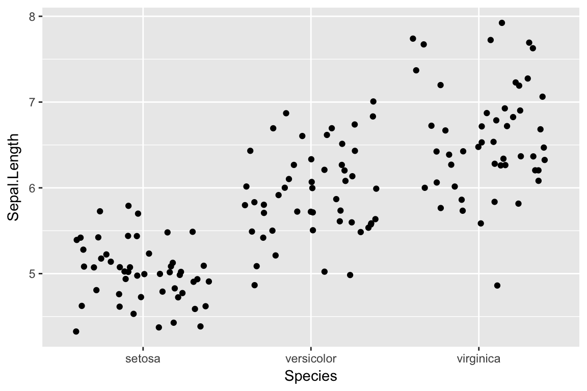

```r
ggplot(iris,aes(Species, Sepal.Length)) + geom_quasirandom()
```

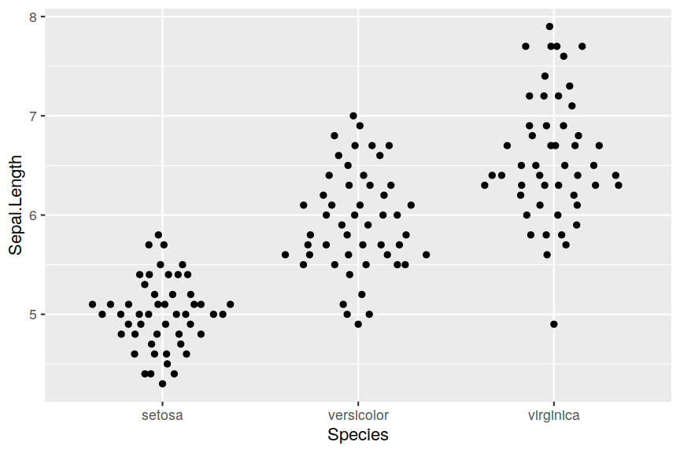

### geom_quasirandom()

Using `geom_quasirandom`:

```r
#default geom_quasirandom
ggplot(mpg,aes(class, hwy)) + geom_quasirandom()
```

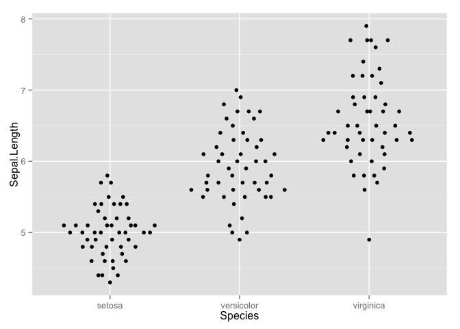

```r
# With categorical y-axis
ggplot(mpg,aes(hwy, class)) + geom_quasirandom()
```

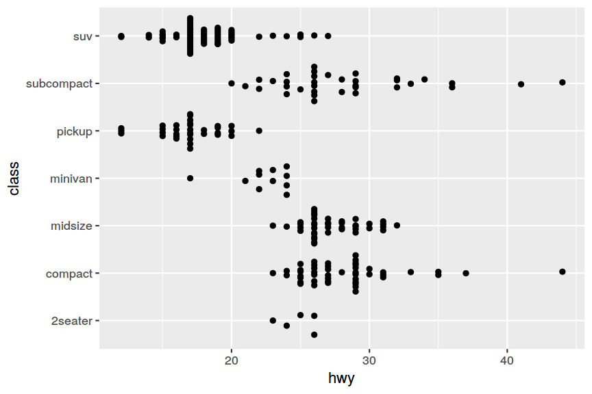

```r
# Some groups may have only a few points. Use `varwidth=TRUE` to adjust width dynamically.
ggplot(mpg,aes(class, hwy)) + geom_quasirandom(varwidth = TRUE)
```

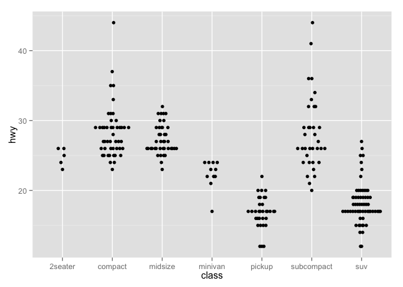

```r
# Automatic dodging
sub_mpg <- mpg[mpg$class %in% c("midsize", "pickup", "suv"),]
ggplot(sub_mpg, aes(class, displ, color=factor(cyl))) + geom_quasirandom(dodge.width=1)
```

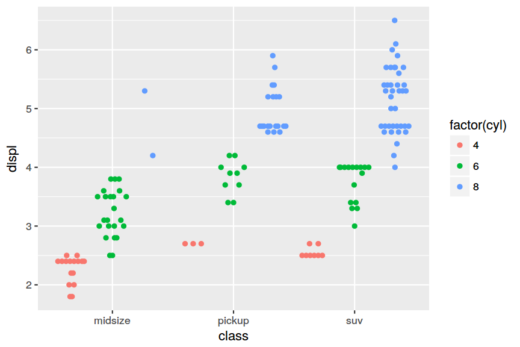

#### Alternative methods
`geom_quasirandom` can also use several other methods to distribute points. For example:

```r
ggplot(iris, aes(Species, Sepal.Length)) + geom_quasirandom(method = "tukey") + 
    ggtitle("Tukey texture")
```

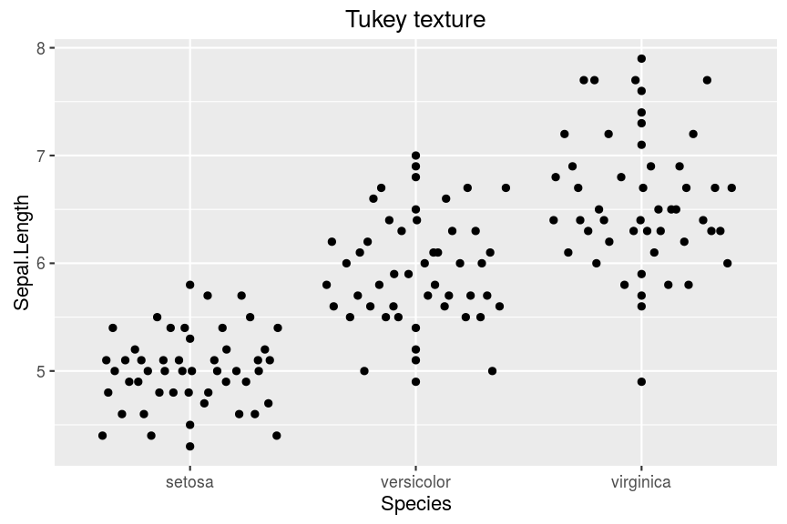

```r
ggplot(iris, aes(Species, Sepal.Length)) + geom_quasirandom(method = "tukeyDense") + 
    ggtitle("Tukey + density")
```

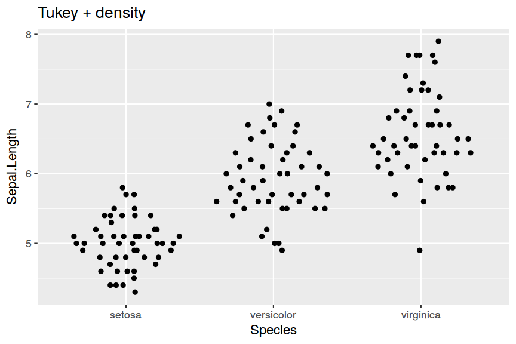

```r
ggplot(iris, aes(Species, Sepal.Length)) + geom_quasirandom(method = "frowney") + 
    ggtitle("Banded frowns")
```

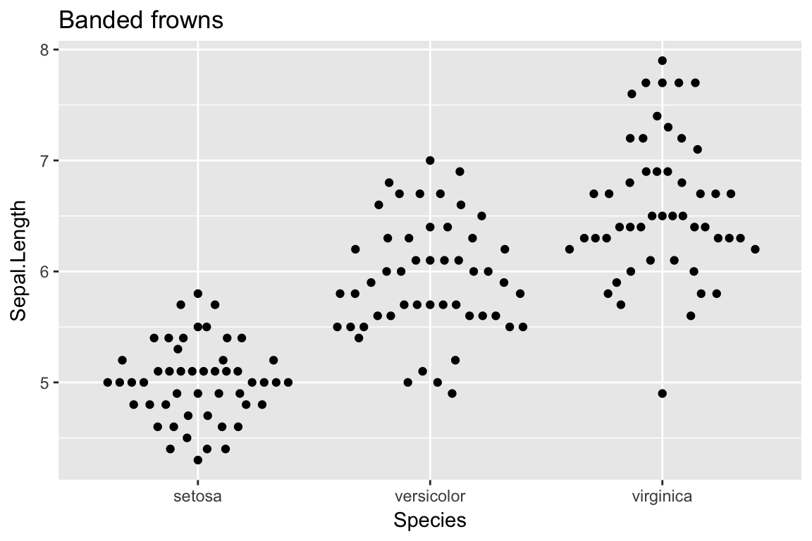

```r
ggplot(iris, aes(Species, Sepal.Length)) + geom_quasirandom(method = "smiley") + 
    ggtitle("Banded smiles")
```

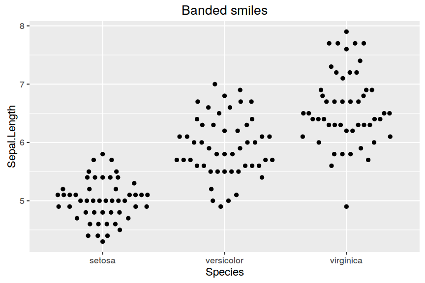

```r
ggplot(iris, aes(Species, Sepal.Length)) + geom_quasirandom(method = "pseudorandom") + 
    ggtitle("Jittered density")
```

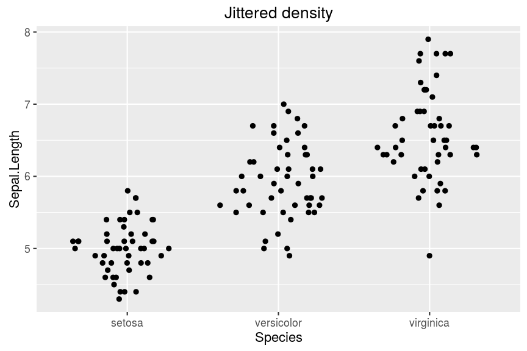

### geom_beeswarm()

Using `geom_beeswarm`:

```r
ggplot(iris,aes(Species, Sepal.Length)) + geom_beeswarm()
```

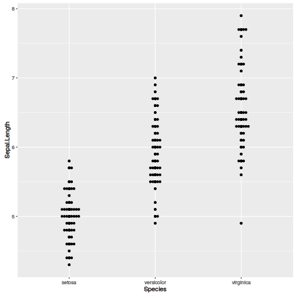

```r
ggplot(mpg,aes(class, hwy)) + geom_beeswarm()
```

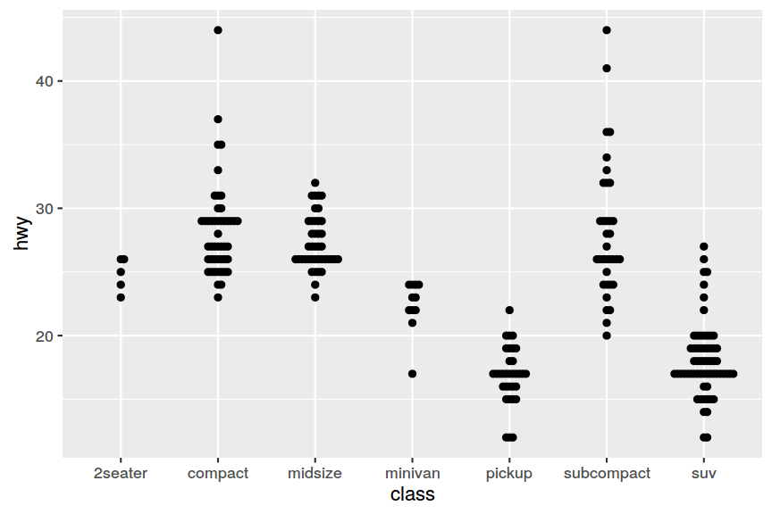

```r
# With categorical y-axis
ggplot(mpg,aes(hwy, class)) + geom_beeswarm(cex=1.2)
```

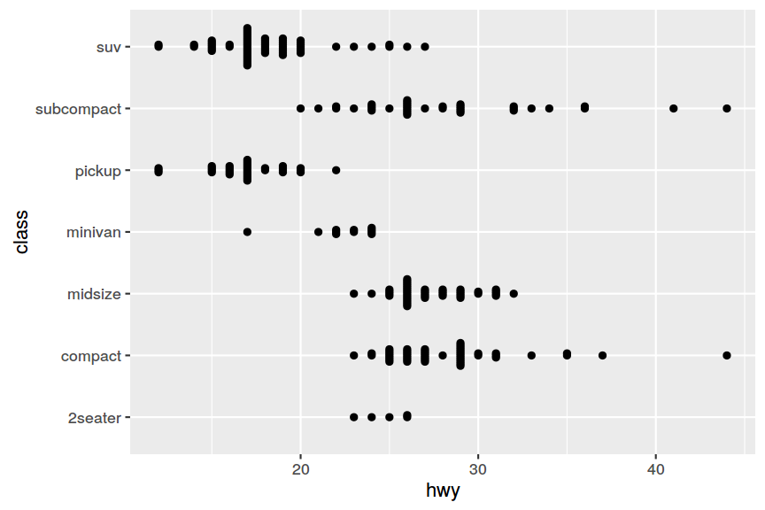

```r
# ggplot doesn't pass any information about the actual device size of the points
# to the underlying layout code, so it's important to manually adjust the `cex` 
# parameter for best results
# Also watch out for points escaping from the plot with geom_beeswarm
ggplot(mpg,aes(class, hwy)) + geom_beeswarm(cex=1.1)
```

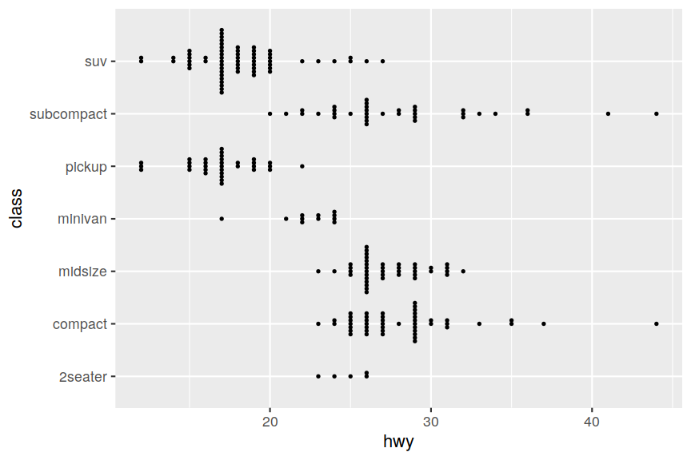

```r
ggplot(iris,aes(Species, Sepal.Length)) + geom_beeswarm(cex=1.2,priority='density')
```

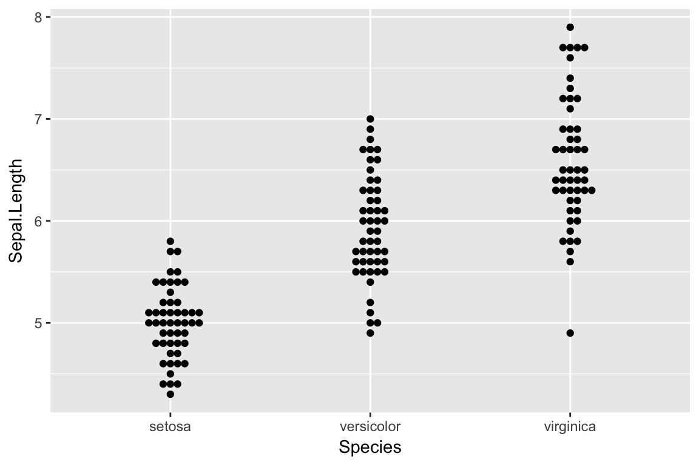

```r
# With automatic dodging
ggplot(sub_mpg, aes(class, displ, color=factor(cyl))) + geom_beeswarm(dodge.width=0.5)
```

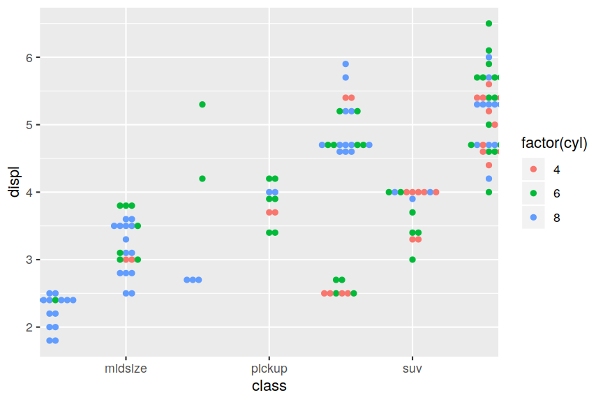


------
Authors: Erik Clarke and Scott Sherrill-Mix

