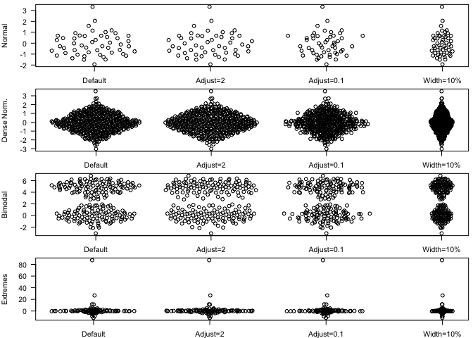

# Beeswarm-style plots with base graphics and ggplot2

## Introduction

`ggbeeswarm` provides a way to generate beeswarm-style plots using both R's default plotting system as well as [ggplot2](http://ggplot2.org). It uses a [van der Corput sequence](http://en.wikipedia.org/wiki/Van_der_Corput_sequence) to space the dots to avoid overplotting. See the examples below.

Beeswarm plots (aka column scatter plots or violin scatter plots) are a way of plotting points that would ordinarily overlap so that they fall next to each other instead. In addition to reducing overplotting, it helps visualize the density of the data at each point (similar to a violin plot), while still showing each data point individually.

## Installation


```r
devtools::install_github("eclarke/ggbeeswarm")
```

## Examples

### Using base graphics

We use the provided function `offset_x` to generate the x-offsets for plotting.

```r
library(ggbeeswarm)
# Generate data
dat <- list(rnorm(50), rnorm(500), c(rnorm(100), rnorm(100,5)), rcauchy(100))
labels <- c("Normal", "Dense Norm.", "Bimodal", "Extremes")

# Plot distributions
par(mfrow=c(4,1), mar=c(2,4, 0.5, 0.5))
mapply(function(y, label) {
  ids <- rep(1:4, each=length(y))
  offsets <- c(
    offset_x(y),  # Default
    offset_x(y, adjust=2),    # More smoothing
    offset_x(y, adjust=0.1),  # Tighter fit
    offset_x(y, width=0.1))   # Less wide

  plot(offsets + ids, rep(y, 4), ylab=label, xlab='', xaxt='n', pch=21, las=1)
  axis(1, 1:4, c("Default", "Adjust=2", "Adjust=0.1", "Width=10%"))
}, dat, labels)
```

 

### Using ggplot2

`ggbeeswarm` provides a `position_beeswarm` extension to ggplot2:

```r
library(ggplot2)
qplot(Species, Sepal.Length, data=iris, position=position_beeswarm())
```

 

```r
qplot(class, hwy, data=mpg, position=position_beeswarm())
```

 

```r
# Some groups may have only a few points. Use `varwidth=TRUE` to adjust width dynamically.
qplot(class, hwy, data=mpg, position=position_beeswarm(varwidth = TRUE))
```

 

------
Authors: Erik Clarke and Scott Sherrill-Mix

Van der Corput sequence generator and helper functions from [https://stat.ethz.ch/pipermail/r-help/2008-May/162911.html](https://stat.ethz.ch/pipermail/r-help/2008-May/162911.html).
