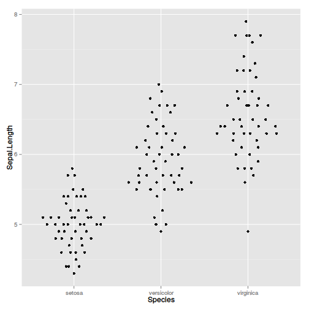
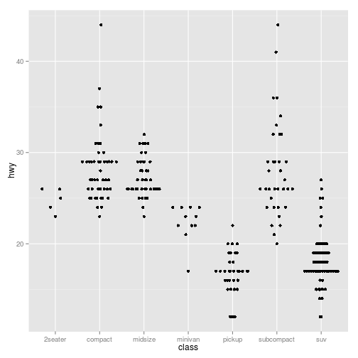
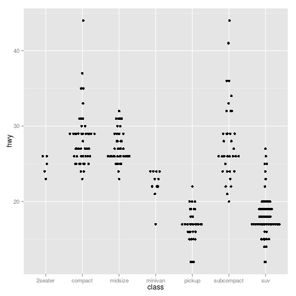
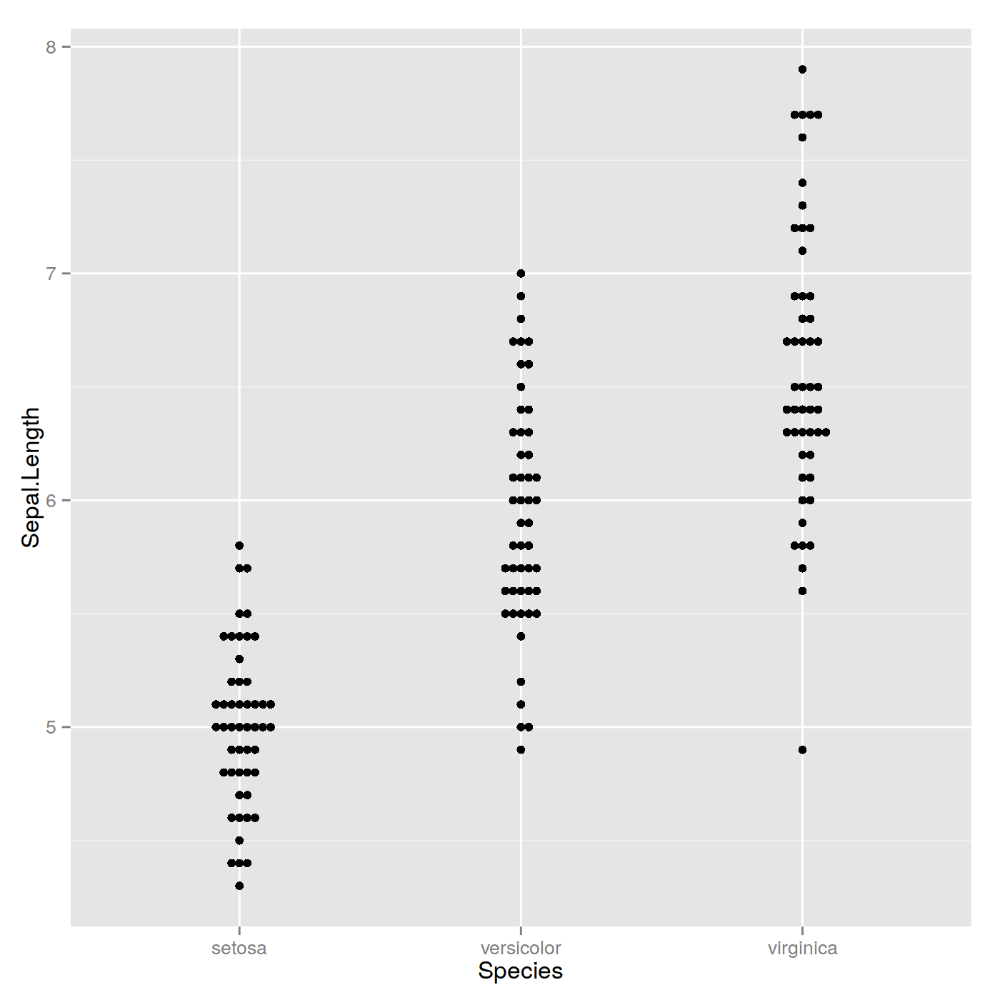
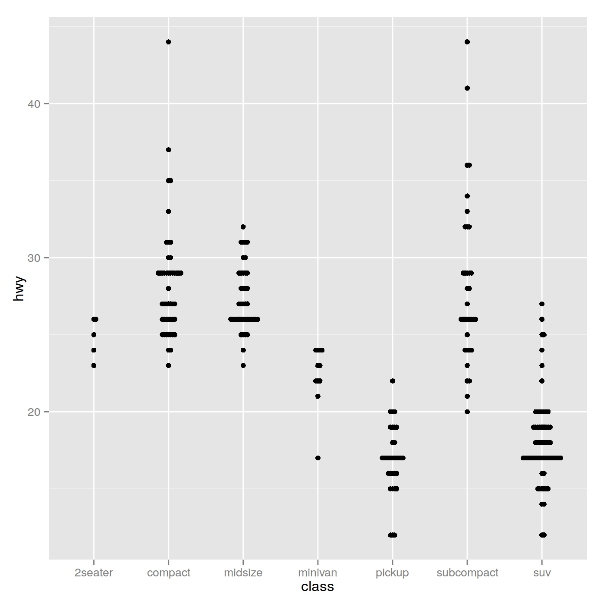
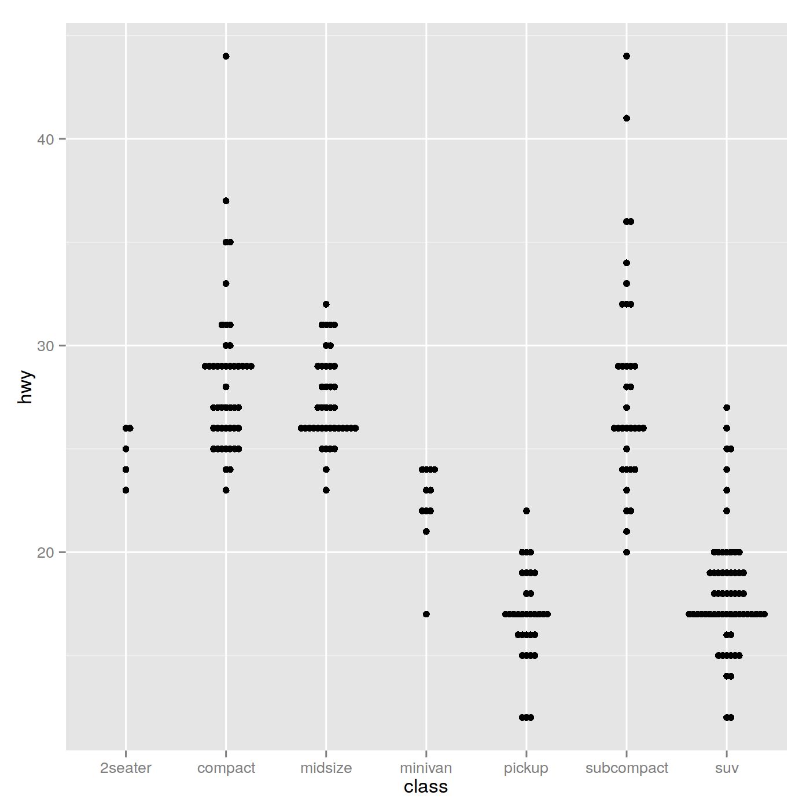

# Beeswarm-style plots with ggplot2

## Introduction

`violinpoint` provides a way to generate beeswarm-style plots using [ggplot2](http://ggplot2.org). It uses a [van der Corput sequence](http://en.wikipedia.org/wiki/Van_der_Corput_sequence) to space the dots to avoid overplotting. See the examples below.

Beeswarm plots (aka column scatter plots or violin scatter plots) are a way of plotting points that would ordinarily overlap so that they fall next to each other instead. In addition to reducing overplotting, it helps visualize the density of the data at each point (similar to a violin plot), while still showing each data point individually.

## Installation


```r
devtools::install_github("eclarke/violinpoint")
```

## Examples

### Using ggplot2

`violinpoint` provides a `position_quasirandom` extension to ggplot2:

```r
set.seed(12345)
library(violinpoint)
library(ggplot2)
qplot(Species, Sepal.Length, data=iris, position=position_quasirandom())
```

 

```r
qplot(class, hwy, data=mpg, position=position_quasirandom())
```

 

```r
# Some groups may have only a few points. Use `varwidth=TRUE` to adjust width dynamically.
qplot(class, hwy, data=mpg, position=position_quasirandom(varwidth = TRUE))
```

 

### Using ggplot2 and beeswarm

`violinpoint` provides a `position_beeswarm` extension to ggplot2:

```r
library(violinpoint)
library(ggplot2)
qplot(Species, Sepal.Length, data=iris, position=position_beeswarm())
```

 

```r
qplot(class, hwy, data=mpg, position=position_beeswarm())
```

 

```r
qplot(class, hwy, data=mpg, position=position_beeswarm(priority = 'density',cex=3))
```

 


------
Authors: Erik Clarke and Scott Sherrill-Mix

